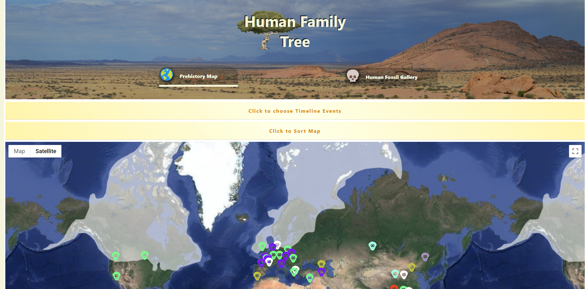

# Human Family Tree

Human Family Tree is a tool for anyone who is intrigued by human history and would like a way to view 2 million years in the context of an interactive map.

[Live Site](https://humanfamilytree.netlify.app/fossil_gallery)

# Technologies

1. React.js 17.0.2
2. React Google Maps API 2.2.0
3. Material UI Core 4.12.3

Notes:

Testing around MUI Components requires awareness

> Inline Function calling in MUI styles Objects to return a property from the theme Object will fail a test. To bypass this failure an Optional Chaining operator has been added to all affected

> JavaScript/React/JSX Comments that extend themselves by multi-lines will be marked "// --> some text continued" to make description easier to read and follow

> Property/Values being passed down that are not necessarily utilized by children components who are also Parent components to the intended target Component for these property/values
> will often be seen merged onto a Components prop Object by using {...somePropObject} to avoid writing out the property/values for each child descendent
